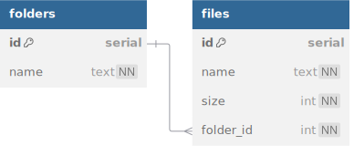

# Filez

Filez is a next-gen file management platform built for extreme speed and performance.
Your folders and files have never felt snappier!

## Database



<details>
<summary>See DBML</summary>

```dbml
table folders {
  id serial [pk]
  name text [unique, not null]
}

table files {
  id serial [pk]
  name text [not null]
  size int [not null]
  folder_id int [not null]

  indexes {
    (name, folder_id) [unique]
  }
}

Ref: folders.id < files.folder_id
```

</details>

1. Create a new database named `filez`.
2. Write `db/schema.sql` to create tables according to the schema above.
   - The `name` column of `folders` is unique.
   - The _combination_ of `name` and `folder_id` of `files` is unique. (see [docs](https://www.postgresql.org/docs/current/ddl-constraints.html#DDL-CONSTRAINTS-UNIQUE-CONSTRAINTS)!)
   - There is a one-many relation: one folder can have many files.
   - Folder deletion should cascade to all related files.
3. Complete `seed.js` (and necessary queries) to seed the database with 3 folders.
   Each folder should be seeded with at least 5 files.

Test your code with `npm run test:database` before moving on.

## Server

Once your database is properly seeded, build an Express app that serves the following
routes. Write database queries as necessary. Remember to use the appropriate body-parsing
and error-handling middleware!

- `GET /files` sends array of all files
  - the name of the containing folder should be included as `folder_name`
- `GET /folders` sends array of all folders
- `GET /folders/:id`
  - Sends 404 error message if folder doesn't exist
  - Sends the folder specified by id, including an array of all files in that folder under
    the `files` key of the folder object.
    - In your SQL query, use `json_agg` instead of `to_json` for array instead of object.
- `POST /folders/:id/files`
  - Sends 404 error message if folder doesn't exist
  - Sends 400 if request body is not provided
  - Sends 400 if request body is missing required fields
  - Creates a new file related to the specified folder and sends the file back with status 201

You can test your code with `npm run test:server`.
